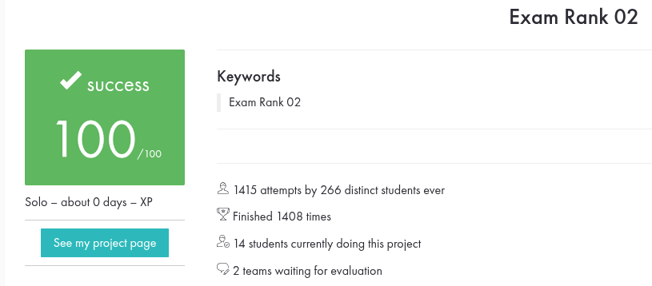
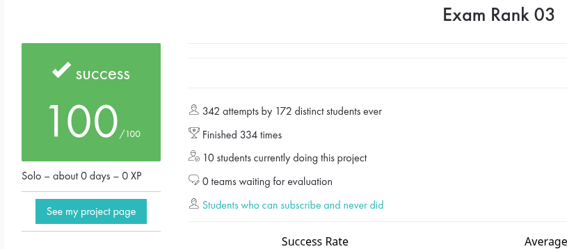

<h1 align="center">EXAM'S 42</h1>

This functions are made by me and some help with others repositories, This is meant to guide those who need help, not to be copied entirely without understanding.

## Contato

